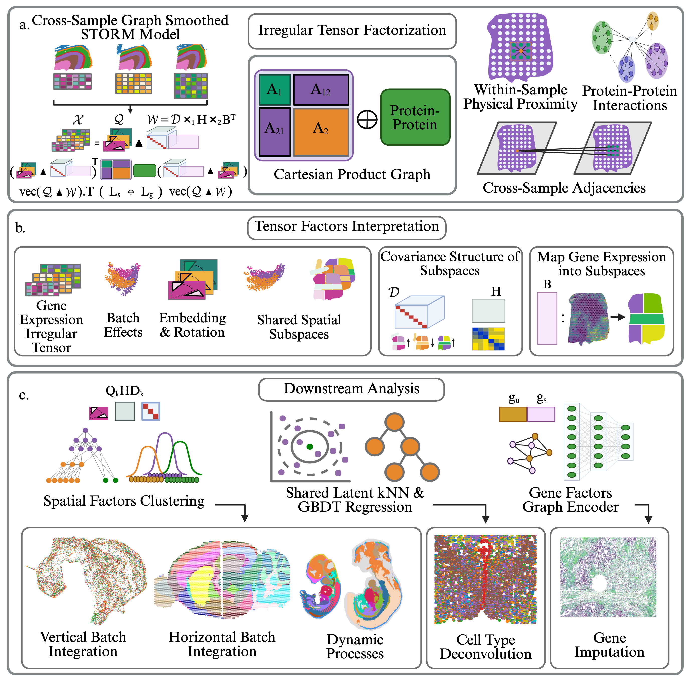

# STORM


STORM- Subspace Tensor Orthogonal Rotation Model for spatial transcriptomics. An interpretable irregular tensor factorization framework that jointly embeds multiple Spatial Transcriptomics slices into a shared latent space via gene/spatial/cross slice graph-regularized PARAFAC2 decomposition. Supports vertical and horizontal batch integration, cell-type deconvolution from scRNA-seq references, unmeasured gene imputation, and spatiotemporal analysis.

In this repository we present the files needed to reproduce the benchmarking results stated in our paper, specifically the horizontal integration of the anterior and posterior mouse brain sections, the vertical integrations of the dorsolateral prefrontal cortex samples, the mouse embryo organogenesis analysis, the cell type deconvolution studies on synthetic and real data, and the gene imputation analyses. 

# Benchmark Validation Tests
We provide a .yaml file for setting up a conda environment for STORM. 

# STORM — Environment Setup

## Installation

```bash
conda env create -f env_cpu.yml
conda activate st-graph-parafac2-cpu
```

## Key Dependencies

| Package | Version | Role |
|---|---|---|
| Python | 3.11 | Base interpreter |
| PyTorch | 2.5.1 (CPU) | Tensor operations and ADMM solver |
| Scanpy | 1.11 | Single-cell and spatial transcriptomics preprocessing |
| AnnData | 0.12 | Data structures for gene expression matrices |
| Squidpy | 1.6 | Spatial neighborhood graph construction and spatial statistics |
| scikit-learn | 1.7 | GBDT deconvolution, kNN regression, PCA |
| SciPy | 1.16 | Sparse linear algebra and CG solver |
| NumPy | 1.26 | Array operations |
| R | 4.3 | Statistical computing backend |
| rpy2 | 3.5 | Python-to-R interface |
| r-mclust | 6.1 | Gaussian mixture model clustering |
| POT | 0.9 | Optimal transport |
| paste-bio | 1.4 | PASTE cross-slice spatial registration |
| UMAP-learn | 0.5 | Dimensionality reduction and visualization |
| PyNNDescent | 0.5 | Approximate nearest neighbor search |
| leidenalg | 0.10 | Community detection for spatial domain identification |
| python-igraph | 0.10 | Graph data structures for Leiden clustering |
| mygene | 3.2 | Ensembl-to-symbol gene ID mapping for PPI graph construction |
| h5py | 3.15 | Reading and writing h5ad files |
| Matplotlib | 3.10 | Visualization and spatial plots |
| Seaborn | 0.13 | Statistical data visualization |
| Numba | 0.62 | JIT compilation for performance-critical loops |
| Dask | 2024.11 | Optional parallelism for large datasets |

Once your workspace is properly set, you can run the tests for each task via the files in the Tests folder (i.e. VerticalIntegration, GeneImputation, etc.) 
  
